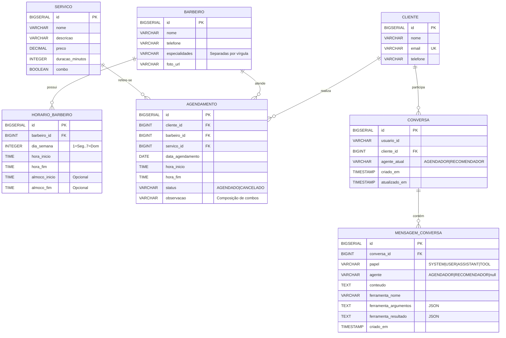

# Diagrama Entidade-Relacionamento - SGS-BARBER

## Notas

- **Separação de agentes**: `CONVERSA.agente_atual` rastreia se a conversa está com Agendador ou Recomendador (handoff via `encaminhar_para_agente`).
- **Function Calling**: `MENSAGEM_CONVERSA` armazena `ferramenta_nome`, `ferramenta_argumentos` (JSON) e `ferramenta_resultado` (JSON), permitindo reconstruir o histórico no formato `/chat/completions` (role=tool/tool_call).
- **Combos**: `SERVICO.combo = true` indica combo multi-serviço. Em `AGENDAMENTO`, a duração total fica em `hora_inicio/hora_fim` e a composição é registrada em `observacao`.
- **Almoço**: `HORARIO_BARBEIRO` modela pausa com `almoco_inicio`/`almoco_fim` (opcionais). O serviço impede reserva durante esse intervalo.
- **Concorrência**: criação de agendamento usa lock pessimista (`BarbeiroRepository.findByIdComLock`) para evitar sobreposição entre requisições simultâneas.
- **Índices**: otimizam consulta de disponibilidade (`agendamento.barbeiro_id+data_agendamento`) e histórico de conversa (`mensagem_conversa.conversa_id+criado_em`).
