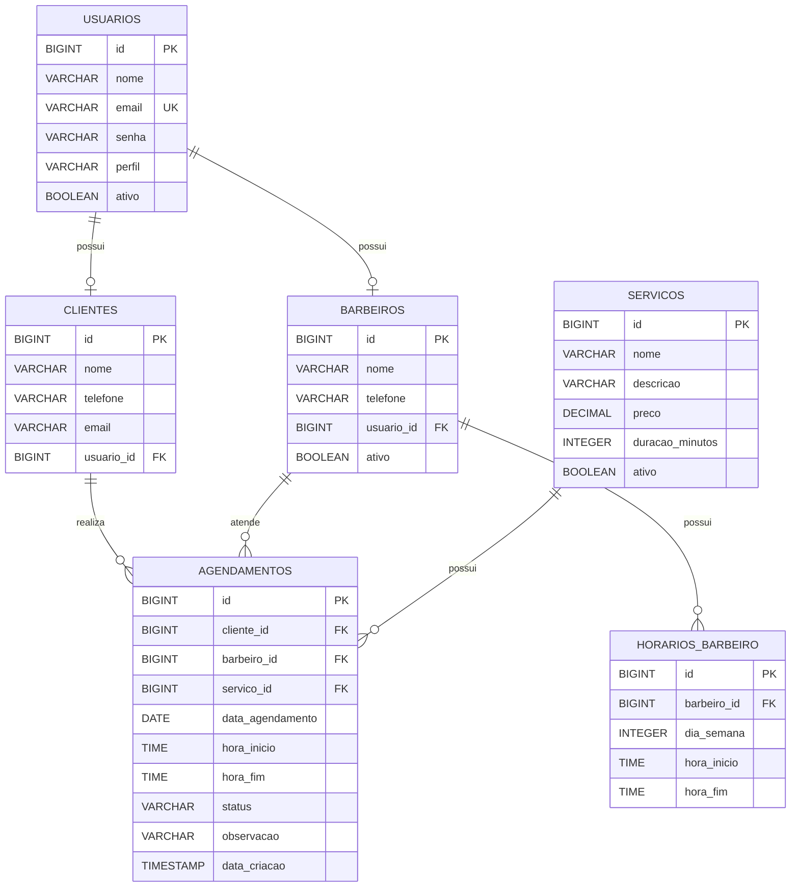

# 💈 SGS-BARBER

### Sistema de Gestão de Agendamento para Barbearia

O **SGS-BARBER** é um sistema web desenvolvido para facilitar o gerenciamento de agendamentos em barbearias, proporcionando uma forma simples e organizada de controlar clientes, barbeiros, serviços e horários.

O projeto surgiu a partir da necessidade de reduzir problemas comuns no gerenciamento manual de agendamentos, como conflitos de horários, esquecimentos, dificuldade para visualizar a agenda e perda de tempo durante o atendimento.

A proposta é centralizar essas informações em uma única aplicação, permitindo que a barbearia tenha maior organização e controle sobre seus atendimentos.

---

## 🎯 Objetivo

Desenvolver uma aplicação web capaz de auxiliar uma barbearia no gerenciamento de seus clientes, barbeiros, serviços e agendamentos.

O sistema permitirá:

* 👤 Cadastro e gerenciamento de clientes;
* 💈 Cadastro e gerenciamento de barbeiros;
* ✂️ Cadastro de serviços;
* 🕐 Definição e consulta de horários disponíveis;
* 📅 Criação de agendamentos;
* 🔄 Alteração de agendamentos;
* ❌ Cancelamento de agendamentos;
* 📋 Visualização da agenda;
* 🗂️ Consulta do histórico de agendamentos;
* 🚫 Prevenção de conflitos de horários.

---

## 🚀 Tecnologias utilizadas

### Front-End

* HTML5
* CSS3
* JavaScript

### Back-End

* Java
* Spring Boot
* Spring Data JPA
* API REST

### Banco de Dados

* PostgreSQL
* SUPABASE

### Ferramentas

* Visual Studio Code
* IntelliJ IDEA
* Git
* GitHub
* Postman
* Figma

---

## 🏗️ Arquitetura do projeto

O sistema utiliza uma arquitetura simples, dividida em três partes principais:

```text
┌──────────────────────────────┐
│          USUÁRIO             │
└──────────────┬───────────────┘
               │
               ▼
┌──────────────────────────────┐
│          FRONT-END           │
│                              │
│ HTML + CSS + JavaScript      │
└──────────────┬───────────────┘
               │
               │ HTTP / JSON
               ▼
┌──────────────────────────────┐
│           BACK-END           │
│                              │
│ Java + Spring Boot           │
│ API REST + JPA               │
└──────────────┬───────────────┘
               │
               ▼
┌──────────────────────────────┐
│         BANCO DE DADOS       │
│                              │
│ PostgreSQL                   │
└──────────────────────────────┘
```

---

# 🗄️ Modelagem do Banco de Dados

O banco de dados do SGS-BARBER foi estruturado para armazenar as principais informações necessárias para o funcionamento do sistema.

## 📊 Diagrama Entidade-Relacionamento

> O diagrama abaixo é renderizado automaticamente pelo GitHub.



---


## Sprint 01

* [ ] Configuração do banco PostgreSQL
* [ ] Estrutura inicial do Spring Boot
* [ ] CRUD de clientes
* [ ] CRUD de barbeiros
* [ ] CRUD de serviços
* [ ] Front-End inicial
* [ ] Integração Front-End ↔ Back-End
* [ ] Sistema funcionando localmente
* [ ] Testes iniciais

## Sprint 02

* [ ] Cadastro de horários dos barbeiros
* [ ] Consulta de disponibilidade
* [ ] Criação de agendamentos
* [ ] Validação de conflito de horários
* [ ] Alteração de agendamentos
* [ ] Cancelamento de agendamentos
* [ ] Visualização da agenda
* [ ] Histórico de agendamentos
* [ ] Integração com agente de IA
* [ ] Testes de comunicação com a API de IA

---

# 🚫 Escopo

O SGS-BARBER tem como foco o gerenciamento de agendamentos de uma barbearia.

Não fazem parte do escopo inicial:

* Controle financeiro completo;
* Controle de estoque;
* Folha de pagamento;
* Controle de comissões;
* Emissão de notas fiscais;
* Aplicativo mobile nativo;
* Integrações complexas com sistemas externos.

---

# 👨‍💻 Equipe

| Integrante           | Responsabilidade                                  |
| -------------------- | ------------------------------------------------- |
| **Erik Menezes**     | Gestão, coordenação e integração do projeto       |
| **Wesley Gonçalves** | Back-End Java + Spring Boot                       |
| **Thales Tadeu**     | Banco de Dados                    |
| **Lucas**            | CRUDs + integração do agente de IA com o Back-End |
| **Daniel**           | Front-End HTML + CSS + JavaScript                 |
| **André Cauê**       | Qualidade e testes                                |

---

# 📌 Objetivo do projeto

O SGS-BARBER busca oferecer uma solução simples e organizada para o gerenciamento de uma barbearia, permitindo centralizar informações e facilitar o controle dos atendimentos.

A aplicação tem como foco tornar o processo de agendamento mais organizado, reduzir conflitos de horários e facilitar a visualização dos compromissos da barbearia.

---

## 📚 Projeto acadêmico

Projeto desenvolvido para fins acadêmicos no curso de **Análise e Desenvolvimento de Sistemas (ADS)**.

**SGS-BARBER — Sistema de Gestão de Agendamento para Barbearia**
