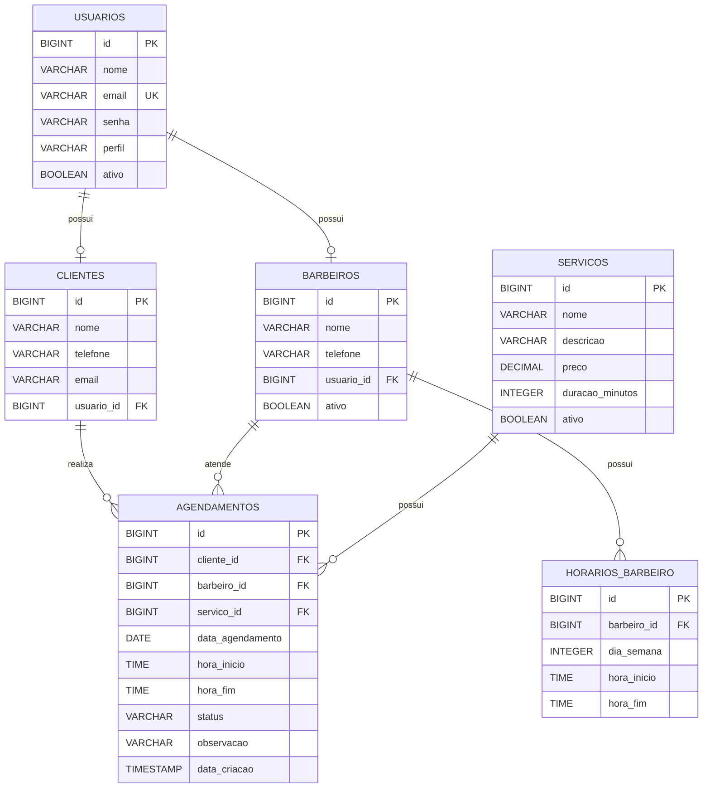

# 💈 SGS-BARBER

### Sistema de Gestão de Agendamento para Barbearia

O **SGS-BARBER** é um sistema web desenvolvido para facilitar o gerenciamento de agendamentos em barbearias, proporcionando uma forma simples e organizada de controlar clientes, barbeiros, serviços e horários.

O projeto surgiu a partir da necessidade de reduzir problemas comuns no gerenciamento manual de agendamentos, como conflitos de horários, esquecimentos, dificuldade para visualizar a agenda e perda de tempo durante o atendimento.

A proposta é centralizar essas informações em uma única aplicação, permitindo que a barbearia tenha maior organização e controle sobre seus atendimentos.

---

## 🎯 Objetivo

Desenvolver uma aplicação web capaz de auxiliar uma barbearia no gerenciamento de seus clientes, barbeiros, serviços e agendamentos.

O sistema permitirá:

* 👤 Cadastro e gerenciamento de clientes;
* 💈 Cadastro e gerenciamento de barbeiros;
* ✂️ Cadastro de serviços;
* 🕐 Definição e consulta de horários disponíveis;
* 📅 Criação de agendamentos;
* 🔄 Alteração de agendamentos;
* ❌ Cancelamento de agendamentos;
* 📋 Visualização da agenda;
* 🗂️ Consulta do histórico de agendamentos;
* 🚫 Prevenção de conflitos de horários.

---

## 🚀 Tecnologias utilizadas

### Front-End

* HTML5
* CSS3
* JavaScript

### Back-End

* Java
* Spring Boot
* Spring Data JPA
* API REST

### Banco de Dados

* PostgreSQL
* SUPABASE

### Ferramentas

* Visual Studio Code
* IntelliJ IDEA
* Git
* GitHub
* Postman
* Figma

---

## 🏗️ Arquitetura do projeto

O sistema utiliza uma arquitetura simples, dividida em três partes principais:

```text
┌──────────────────────────────┐
│          USUÁRIO             │
└──────────────┬───────────────┘
               │
               ▼
┌──────────────────────────────┐
│          FRONT-END           │
│                              │
│ HTML + CSS + JavaScript      │
└──────────────┬───────────────┘
               │
               │ HTTP / JSON
               ▼
┌──────────────────────────────┐
│           BACK-END           │
│                              │
│ Java + Spring Boot           │
│ API REST + JPA               │
└──────────────┬───────────────┘
               │
               ▼
┌──────────────────────────────┐
│         BANCO DE DADOS       │
│                              │
│ PostgreSQL                   │
└──────────────────────────────┘
```

---

# 🗄️ Modelagem do Banco de Dados

O banco de dados do SGS-BARBER foi estruturado para armazenar as principais informações necessárias para o funcionamento do sistema.

## 📊 Diagrama Entidade-Relacionamento

> O diagrama abaixo é renderizado automaticamente pelo GitHub.


```mermaid
erDiagram

    USUARIOS {
        BIGINT id PK
        VARCHAR nome
        VARCHAR email UK
        VARCHAR senha
        VARCHAR perfil
        BOOLEAN ativo
    }

    CLIENTES {
        BIGINT id PK
        VARCHAR nome
        VARCHAR telefone
        VARCHAR email
        BIGINT usuario_id FK
    }

    BARBEIROS {
        BIGINT id PK
        VARCHAR nome
        VARCHAR telefone
        BIGINT usuario_id FK
        BOOLEAN ativo
    }

    SERVICOS {
        BIGINT id PK
        VARCHAR nome
        VARCHAR descricao
        DECIMAL preco
        INTEGER duracao_minutos
        BOOLEAN ativo
    }

    HORARIOS_BARBEIRO {
        BIGINT id PK
        BIGINT barbeiro_id FK
        INTEGER dia_semana
        TIME hora_inicio
        TIME hora_fim
    }

    AGENDAMENTOS {
        BIGINT id PK
        BIGINT cliente_id FK
        BIGINT barbeiro_id FK
        BIGINT servico_id FK
        DATE data_agendamento
        TIME hora_inicio
        TIME hora_fim
        VARCHAR status
        VARCHAR observacao
        TIMESTAMP data_criacao
    }

    USUARIOS ||--o| CLIENTES : possui
    USUARIOS ||--o| BARBEIROS : possui

    BARBEIROS ||--o{ HORARIOS_BARBEIRO : possui

    CLIENTES ||--o{ AGENDAMENTOS : realiza
    BARBEIROS ||--o{ AGENDAMENTOS : atende
    SERVICOS ||--o{ AGENDAMENTOS : possui
```

---


## Sprint 01

* [ ] Configuração do banco PostgreSQL
* [ ] Estrutura inicial do Spring Boot
* [ ] CRUD de clientes
* [ ] CRUD de barbeiros
* [ ] CRUD de serviços
* [ ] Front-End inicial
* [ ] Integração Front-End ↔ Back-End
* [ ] Sistema funcionando localmente
* [ ] Testes iniciais

## Sprint 02

* [ ] Cadastro de horários dos barbeiros
* [ ] Consulta de disponibilidade
* [ ] Criação de agendamentos
* [ ] Validação de conflito de horários
* [ ] Alteração de agendamentos
* [ ] Cancelamento de agendamentos
* [ ] Visualização da agenda
* [ ] Histórico de agendamentos
* [x] Integração com agente de IA
* [ ] Testes de comunicação com a API de IA

---

# 🤖 Sprint 03 — Agente de IA

O front-end deixou de simular respostas. Agora a mensagem do usuário vai para
`POST /api/chat`, o back-end escolhe o agente, o modelo chama as *tools* contra
o banco e a resposta volta com o rastro do que foi consultado.

## Como rodar

```bash
# 1. banco
psql -U postgres -f Database/Scripts/DDL.sql

# 2. back-end
cd Backend/sgs-barber
./mvnw spring-boot:run              # Linux/macOS
mvnw.cmd spring-boot:run             # Windows

# 3. front-end (servidor estático qualquer)
cd FrontEnd
python -m http.server 5500           # e abra http://localhost:5500/dashboard.html
```

## Variáveis de ambiente

| Variável | Obrigatória | Padrão | Para quê |
| --- | --- | --- | --- |
| `IA_API_KEY` | para reservar | — | Chave do provedor de modelo. Sem ela o sistema **não confirma agendamentos** |
| `IA_HABILITADA` | não | `true` | `false` desliga toda chamada de modelo |
| `IA_MODELO` | não | `gpt-4o-mini` | Modelo usado |
| `IA_BASE_URL` | não | `https://api.openai.com/v1` | Base do provedor. Qualquer serviço compatível com OpenAI funciona trocando só isto |
| `IA_TEMPERATURA` | não | `0.2` | Aleatoriedade da resposta |
| `IA_TIMEOUT_MS` | não | `30000` | Tempo limite de uma chamada ao modelo |
| `IA_MAX_ITERACOES` | não | `6` | Teto de voltas (chamada de modelo + tools) por mensagem |
| `IA_MAX_TENTATIVAS` | não | `3` | Retentativa quando o provedor devolve 429/5xx |
| `IA_ESPERA_RETRY_MS` | não | `2500` | Espera base entre retentativas (cresce a cada tentativa) |
| `IA_MAX_MENSAGENS` | não | `8` | Quantas mensagens do histórico vão no contexto |
| `IA_MAX_TOKENS` | não | `700` | Teto de tokens de resposta. Resposta de chat não precisa de mais |
| `IA_FALLBACK` | não | `true` | `false` faz o sistema falhar em vez de cair no agente de regras |
| `IA_AGENDADOR_ATIVO` | não | `true` | `false` desliga o assistente: o menu some e `/api/chat` responde 503 |
| `CORS_ORIGENS` | não | só loopback | Domínios liberados em produção |

### provedores gratuitos

Como a base é compatível com OpenAI, trocar de provedor é só mudar duas variáveis:

| Provedor | Chave | `IA_BASE_URL` | `IA_MODELO` |
| --- | --- | --- | --- |
| Google Gemini | [aistudio.google.com/apikey](https://aistudio.google.com/apikey) | `https://generativelanguage.googleapis.com/v1beta/openai/` | `gemini-3.7-flash` |
| Groq | [console.groq.com/keys](https://console.groq.com/keys) | `https://api.groq.com/openai/v1` | `llama-3.3-70b-versatile` |
| OpenRouter | [openrouter.ai/keys](https://openrouter.ai/keys) | `https://openrouter.ai/api/v1` | um modelo `:free` |

```powershell
$env:IA_API_KEY="..."; $env:IA_BASE_URL="https://api.groq.com/openai/v1"
$env:IA_MODELO="llama-3.3-70b-versatile"; .\mvnw.cmd spring-boot:run
```

Free tier tem limite de requisições. Quando a cota acaba o sistema não trava: cai no agente de regras e o front avisa que a resposta não veio do modelo.

### Configurar sem digitar nada

Para não setar variável de ambiente a cada execução, crie
`Backend/sgs-barber/ia-local.properties`:

```properties
ia.api-key=sua-chave-aqui
ia.base-url=https://generativelanguage.googleapis.com/v1beta/openai/
ia.modelo=gemini-3.7-flash
```

O `application.properties` importa esse arquivo automaticamente
(`spring.config.import`) e o `.gitignore` o mantém fora do versionamento, então
a chave não vai para o commit. Aí basta `.\mvnw.cmd spring-boot:run` e a IA já
sobe ligada. Variável de ambiente tem prioridade sobre o arquivo, dá para
testar outra chave só passando `$env:IA_API_KEY="..."` na linha do comando.

### Cota do plano gratuito

Plano gratuito responde **429** ou **503 "high demand"** quando a requisição
aumenta. Por isso o cliente repete até `IA_MAX_TENTATIVAS` com espera
crescente e, se ainda assim falhar, o sistema cai no agente de regras e avisa no
chat: cota estourada deixa o assistente menos conversacional, nunca quebrado —
as respostas do agente de regras continuam vindo do banco e estão corretas.

Para **durar mais** na cota, o projeto já corta custo por conta própria:

- o catálogo (serviços e equipe) entra no prompt de sistema, então o modelo não
  gasta uma chamada só para descobrir preço ou nome — era o maior desperdício;
- `IA_MAX_MENSAGENS` é 8, não 20, porque o histórico é reenviado ao provedor a
  cada volta do loop de tools;
- `IA_MAX_TOKENS` limita a resposta, segurando o custo quando o modelo divaga;
- o log em `DEBUG` mostra o tamanho do payload, o número de tools e se o
  catálogo entrou, para medir antes de adivinhar.

Mesmo assim, **cota esgotada não se resolve com código**: 429 significa limite
de janela longa (horária ou diária). O que resolve é cota nova — criar outro
projeto no [AI Studio](https://aistudio.google.com/apikey) dá uma cota separada,
porque o limite é por projeto, não por conta.

### Observação sobre a família 2.5 do Gemini

Modelos `gemini-2.5-*` e `gemini-2.0-*` retornam **HTTP 404** com
`"no longer available to new users"` tanto na API compatível com OpenAI quanto
na nativa, mesmo aparecendo na lista de modelos da chave. Não é problema de
configuração: o Google desativou essa família para contas novas. Use a família
3.x. Modelos que responderam com a chave de teste: `gemini-3.7-flash`,
`gemini-3.6-flash`, `gemini-3.5-flash`, `gemini-3.5-flash-lite` e
`gemini-3.1-flash-lite`. O `gemini-3.8-flash` e o `gemini-pro-latest` estavam
com cota esgotada no mesmo teste.

Observação: o Gemini exige que a *thought signature* de cada chamada de função
seja reenviada na conversa. O cliente faz isso de forma transparente
(`extra_content.google.thought_signature`), então o loop de tools funciona sem
nenhuma configuração do seu lado. Se algum dia aparecer erro 400 informando
"missing a thought_signature", é sinal de que o modelo ou o cliente mudou.

## Endpoints

| Método | Rota | Descrição |
| --- | --- | --- |
| `POST` | `/api/chat` | Envia a mensagem e recebe a resposta do agente |
| `GET` | `/api/chat/config` | Estado real da integração (modelo, chave, fallback) |
| `POST` | `/api/chat/reiniciar/{usuarioId}` | Zera o histórico da conversa |

O corpo de `POST /api/chat` usa **camelCase** — `usuario_id` devolve HTTP 400:

```json
{ "usuarioId": "web-abc123", "mensagem": "há horário com o Daniel amanhã?", "clienteId": null }
```

A resposta traz `mensagem`, `agente`, `agenteNome`, `ferramentasUsadas`,
`encaminhou` e `aviso`.

## Arquitetura

```
FrontEnd ──POST /api/chat──▶ OrquestradorConversa
                                 │
                                 ├─ RoteadorAgente      → Agendador ou Recomendador
                                 ├─ Agente (prompt)     → decide a tool
                                 ├─ RegistroFerramentas → executa no banco
                                 └─ LlmClient           → monta a resposta final
```

O **Agendador** tem permissão de escrita (`criar_agendamento`,
`cancelar_agendamento`); o **Recomendador** só lê o catálogo e, se o assunto for
agenda, devolve o cliente para o Agendador com `encaminhar_para_agente`.

A chave do modelo **nunca** chega ao navegador: quem fala com o provedor é
sempre o back-end.

## Modo sem chave

Sem `IA_API_KEY` o `Agendador` de regras ainda responde consultas de serviços,
equipe e disponibilidade — e o front mostra o aviso de que os dados vieram de
regras. Ele **não reserva**, porque não tem como confirmar com o modelo. Para
agendar nesse cenário, use "Novo Agendamento".

## Como o front encontra o backend

Não há porta fixa no front. Na primeira chamada o `script.js` pergunta
`/api/chat/config` para a própria origem e depois para `localhost:8080`,
`localhost:8081`, `127.0.0.1:8080/8081`, `5173` e `3000`, e fica com o primeiro
que responder. Isso resolve o caso comum: o Spring Boot sobe em `8080` e o front
é aberto por `file://` ou por um servidor estático em outra porta, sem ninguém
configurar nada.

Se o seu backend estiver em outro lugar (IP da rede, porta exótica, deploy),
defina a base antes de carregar o `script.js`:

```html
<script>window.SGS_API_BASE = 'http://192.168.0.10:8090';</script>
```

Se nenhuma porta responder, o front mostra quais endereços ele tentou, em vez
de só dizer "servidor offline". Ele tenta 4 vezes com 1,5 s de intervalo, e
depois disso oferece um botão **reconectar** — não é preciso dar F5, e a
primeira mensagem que dá certo já corrige o estado sozinho.

## Problemas comuns

**`Process terminated with exit code: 1` ao rodar `mvnw.cmd spring-boot:run`**

Quase sempre é porta ocupada. O Maven só mostra o código de saída; a causa
verdadeira está mais acima no log, em `WebServerException: Port 8080 was
already in use`. Descubra quem está segurando e derrube:

```powershell
# ver o processo na 8080
Get-NetTCPConnection -LocalPort 8080 -State Listen |
  ForEach-Object { Get-Process -Id $_.OwningProcess }

# derrubar
Get-NetTCPConnection -LocalPort 8080 -State Listen |
  ForEach-Object { Stop-Process -Id $_.OwningProcess -Force }
```

Acontece quando o Spring sobe duas vezes: uma no seu terminal e outra de um
processo que ficou em segundo plano de uma sessão anterior. Para o diagnóstico
completo, rode com `-e` ou veja a linha `APPLICATION FAILED TO START` no log.

**O front abre e fica em "servidor offline"**

Suba o back-end e espere aparecer `Started SgsBarberApplication` no terminal.
Com o Maven, isso leva cerca de 50 s na primeira compilação. Se você mudou a
porta, suba com `$env:SERVER_PORT=8090` e aponte o front com
`window.SGS_API_BASE`.

**`429` do Gemini**

Janela de cota esgotada, não configuração. Espere a cota renovar ou use outro
projeto/chave — a cota é contada por projeto, não por conta. Veja
[Cota do plano gratuito](#cota-do-plano-gratuito).

## Testes

```bash
cd Backend/sgs-barber
./mvnw.cmd test
```

Cobrem parsing de datas em português, janelas de período, classificação de
agente, permissões por agente, argumentos inválidos e o schema JSON das tools.

---

# 🚫 Escopo

O SGS-BARBER tem como foco o gerenciamento de agendamentos de uma barbearia.

Não fazem parte do escopo inicial:

* Controle financeiro completo;
* Controle de estoque;
* Folha de pagamento;
* Controle de comissões;
* Emissão de notas fiscais;
* Aplicativo mobile nativo;
* Integrações complexas com sistemas externos.

---

# 👨‍💻 Equipe

| Integrante           | Responsabilidade                                  |
| -------------------- | ------------------------------------------------- |
| **Erik Menezes**     | Gestão, coordenação e integração do projeto       |
| **Wesley Gonçalves** | Back-End Java + Spring Boot                       |
| **Thales Tadeu**     | Banco de Dados                    |
| **Lucas**            | CRUDs + integração do agente de IA com o Back-End |
| **Daniel**           | Front-End HTML + CSS + JavaScript                 |
| **André Cauê**       | Qualidade e testes                                |

---

# 📌 Objetivo do projeto

O SGS-BARBER busca oferecer uma solução simples e organizada para o gerenciamento de uma barbearia, permitindo centralizar informações e facilitar o controle dos atendimentos.

A aplicação tem como foco tornar o processo de agendamento mais organizado, reduzir conflitos de horários e facilitar a visualização dos compromissos da barbearia.

---

## 📚 Projeto acadêmico

Projeto desenvolvido para fins acadêmicos no curso de **Análise e Desenvolvimento de Sistemas (ADS)**.

**SGS-BARBER — Sistema de Gestão de Agendamento para Barbearia**
